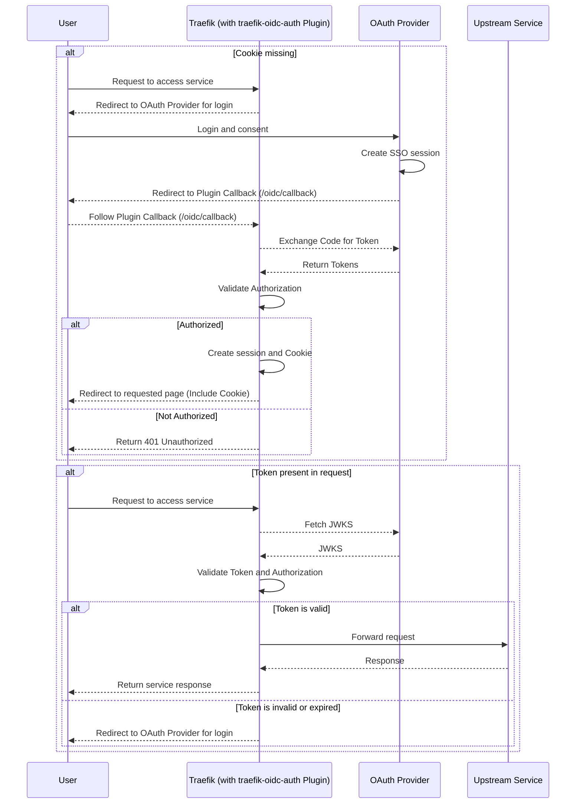
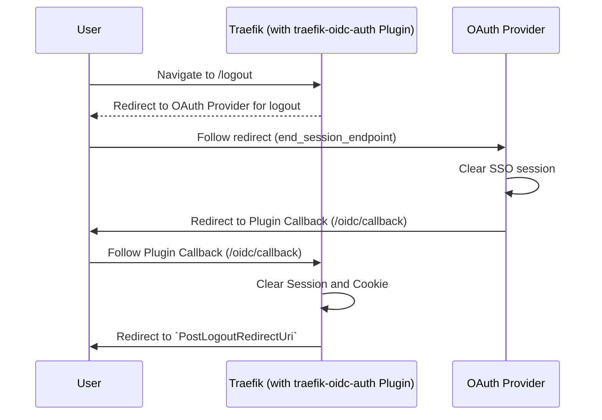

# How this Plugin Works

The *Traefik OIDC Authentication* plugin secures upstream services by integrating OAuth 2.0 authentication directly into the Traefik reverse proxy. Acting as an authentication middleware, the plugin intercepts incoming requests and performs the following steps:

1. **Authentication Verification**  
Checks for the presence of a valid OAuth token, provided via Cookie.

2. **Token Validation**  
Verifies the token with the configured OAuth provider, ensuring it is valid and unexpired.

3. **User Authorization**  
Confirms that the authenticated user has the necessary permissions to access the upstream service. This may involve claim validation or matching user roles.

4. **Request Handling**  
If the token is valid, the plugin allows the request to pass through to the upstream service.
If the token is missing, invalid, or unauthorized, the plugin redirects the user to the OAuth provider's authorization endpoint or returns an HTTP error (e.g., 401 Unauthorized).

The plugin simplifies secure access to protected services, eliminating the need for individual applications to implement OAuth flows. It is especially useful for services running behind Traefik in microservices architectures. Configuration typically includes specifying the OAuth provider, client credentials, and allowed scopes or roles.

## Sequence Diagram



## Logout {#logout}

If you want to log out and remove the session it is simply enough to navigate to the `/logout` route or whatever you've configured for `LogoutUri` in the [Plugin Config Block](./middleware-configuration.md#plugin-config-block).
This can be achieved by a simple link for example:

```html
<a href="/logout">Logout</a>
```
This will then trigger the logout flow which is as follows:



:::tip
The configured `PostLogoutRedirectUri` is the default url to which the user will be redirected after the logout is completed.
You can also specify a different url when navigating to the `/logout` endpoint like this:  
`/logout?redirect_uri=/whatever` or `/logout?post_logout_redirect_uri=/whatever`.  
Both will do the same.
:::
